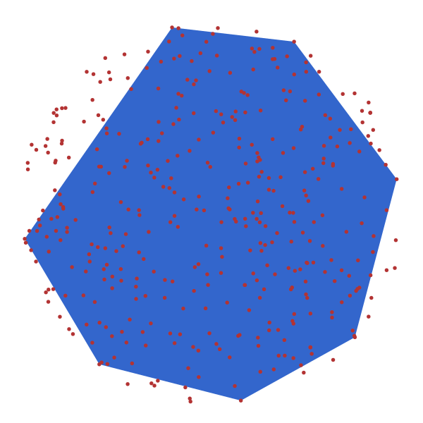

# Approximate 2d point set by k vertex convex polygon

### Written By Sariel Har-Peled, 2025-Sep-16

This code (written in Julia) computes a polygon that approximates the convex-hull of a given set of points (all the in the plane). Specifically, one is given
a parameter k, and the algorithm adds the k points that each of them
add the most area to the current convex-hull. For simplicity, the two
starting points are the two x-extreme points. The algorithms works in
O(n log n) time if you are lucky, and O(n (log n + k) ) if you are
not. There are ways to improve the running time to O(n log n) but I
doubt if it is worth the effort.

Note that this is a heuristic. Computing the k-polygon maximizing the
area can be done by dynamic programming but is significantly more
tedious and slower (i.e., O(n^3)?). This hack should be good enough in
practice.

Most of the code was written by prompting Gemini to generate some
pieces of code and putting them together (with a bit of coding myself
[ha, the suffering]).

## Example of output

#### Low level comments

- For the CH computation, the version provided should be good enough, but it is definitely not super robust. The Delaunay triangulation package seems to provide a more robust implementation if this becomes relevant.

- To improve the running time, one can precompute the convex-hull of all the points, and then use extreme queries to figure out what is the next point to add, instead of the current linear scan approach. 

- The approach used here is probably from this paper:

  > [Practical Methods for Shape Fitting and Kinetic Data Structures using Coresets](https://link.springer.com/article/10.1007/s00453-007-9067-9),
  > Hai Yu, Pankaj K. Agarwal, Raghunath Poreddy & Kasturi R. Varadarajan 

  But it was likely described earlier in some Russian paper from the 3rd century.
  
  
